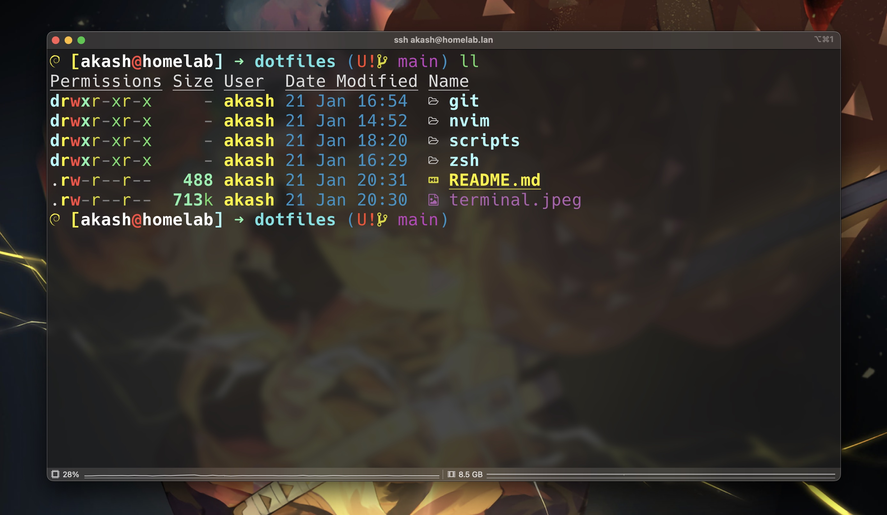

<h1 align="center">
  
  <br />
  Dotfiles
  <br />
  <p align="center">
  
  <a href="https://github.com/AkashRajpurohit/dotfiles/stargazers"></a>
  <a href="https://github.com/AkashRajpurohit/dotfiles/network/members"></a>
  <a href="https://github.com/AkashRajpurohit/dotfiles/issues?q=is%3Aopen+is%3Aissue"></a>
  <a href="https://github.com/AkashRajpurohit/dotfiles/blob/main/LICENSE"></a>
  <a href="https://twitter.com/intent/tweet?url=https%3A%2F%2Fgithub.com%2FAkashRajpurohit%2Fdotfiles"></a>
  </p>
</h1>

## Installing

Clone into your `$HOME/dotfiles` directory or `~/dotfiles`

```bash
git clone https://github.com/AkashRajpurohit/dotfiles.git ~/dotfiles && cd ~/dotfiles
```

## Synching Configurations

To sync all configurations use:

```bash
stow zsh git ghostty scripts bat alacritty
```

For neovim, I have started using the [kickstart.nvim](https://github.com/AkashRajpurohit/kickstart.nvim). Follow the instructions in the README.md file of that repository to setup neovim config.

## Credits

- Managing dotfiles with Stow by chris@machine -> [Video](https://www.youtube.com/watch?v=90xMTKml9O0)
- Effective Neovim by TJ DeVries -> [Video](https://www.youtube.com/watch?v=stqUbv-5u2s), [Github](https://github.com/nvim-lua/kickstart.nvim)

